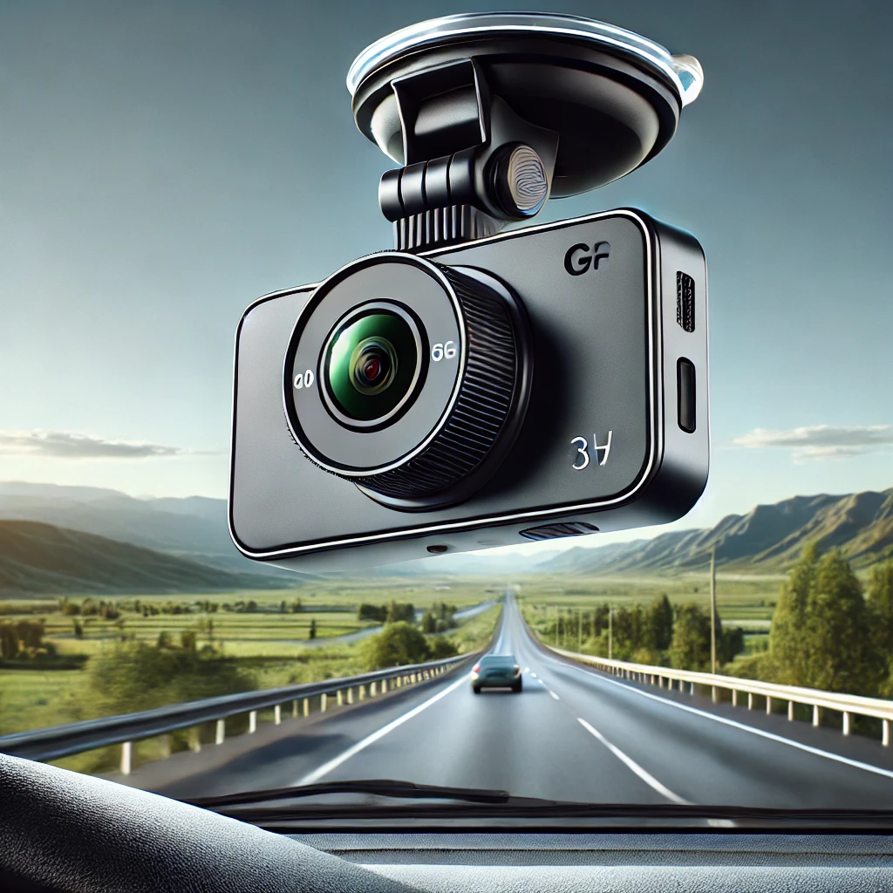

# Dashcam



SW running on a RaspberryPi based dashcam.

## Getting started

### Prerequisites

This application relies on the **Picamera2** library for dealing with the cameras. Before setting up the virtual environment it is necessary to have it installed system wide. If the library is not installed please follow the instructions here: [Picamera2](https://github.com/raspberrypi/picamera2)

### Setup venv

* Setup a python virtual environment and use the system python packages:
    ```
    sudo apt install python3-virtualenv
    python3 -m venv --system-site-packages env
    ```

* Activate virtual environment:
    ```
    source env/bin/activate
    ```

*Picamera2* should be available from the system packages.

### Install dependencies
```
pip install cython
```

### Install package

* Read only
```
python3 setup.py install
```

* Editable
  * Build extensions (this is needed for MSGQ)
    ```
    python3 setup.py build_ext --inplace
    ```

  * Install package via `pip`
    ```
    pip install -e .
    ```

## Remarks

It is known when playing the recored video with e.g. VLC they seem to be laggy. To avoid this a simple post-processing can be run using `ffmpeg` specifying the frame rate can be applied
```
ffmpeg -r 25 -i video.h264 video.mkv
```
